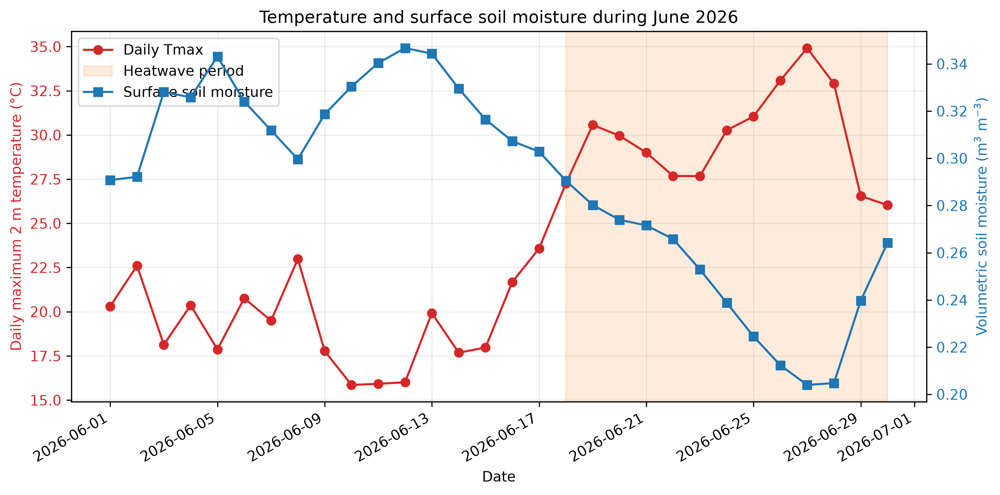
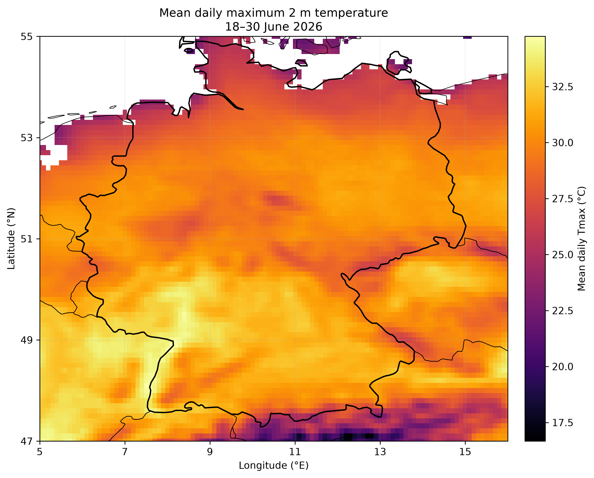
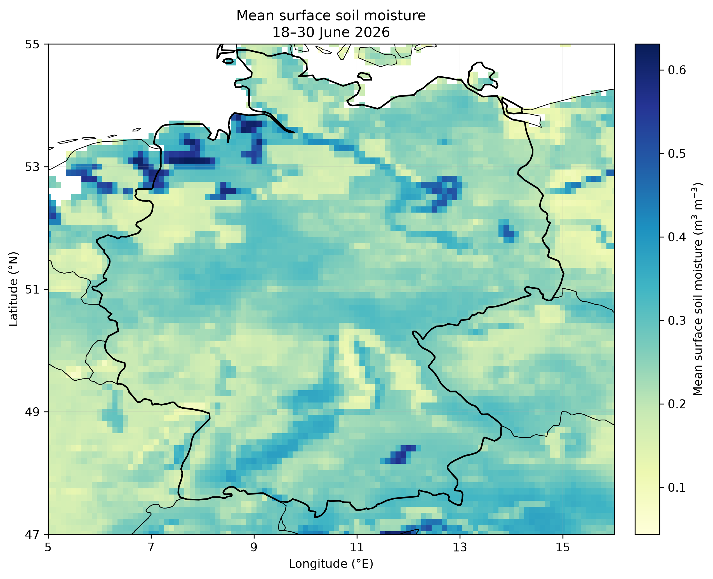
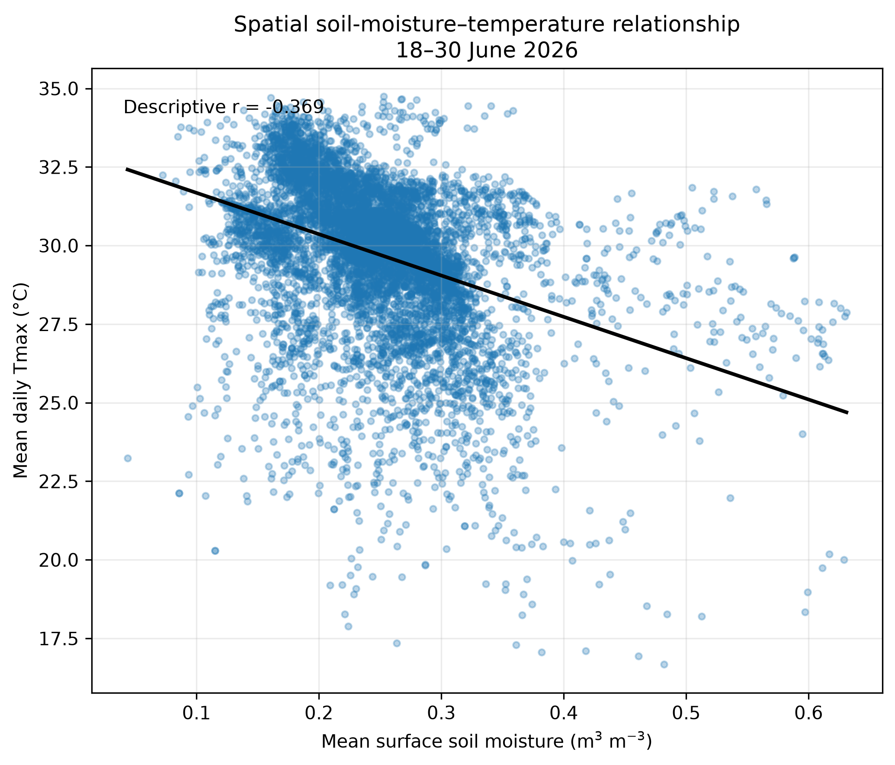

# June 2026 Heatwave over a Germany-Centred Domain
[](https://doi.org/10.5281/zenodo.22693412)
A compact and reproducible ERA5-Land analysis of near-surface temperature
and soil-moisture conditions during the June 2026 European heatwave.

The project examines the evolution and spatial relationship of daily maximum
2 m temperature and surface soil moisture over a Germany-centred Central
European domain.

## Scientific context

Copernicus Climate Change Service (C3S) reported an intense heatwave across
western and central Europe during the second half of June 2026. The period
18–30 June 2026 is used here as the heatwave analysis window.

This project is intended as a small reproducible event-analysis workflow,
rather than a formal heatwave attribution study.

## Study domain and period

- **Dataset:** ERA5-Land hourly reanalysis
- **Context period:** 1–30 June 2026
- **Pre-heatwave period:** 1–17 June 2026
- **Heatwave period:** 18–30 June 2026
- **Domain:** 47–55°N, 5–16°E
- **Horizontal resolution:** 0.1° × 0.1°
- **Variables:**
  - 2 m temperature
  - Volumetric soil water layer 1

The domain covers Germany together with parts of neighbouring countries.
Therefore, domain-mean statistics should not be interpreted as statistics
calculated from a Germany-only administrative mask.

## Methods

Hourly ERA5-Land 2 m temperature is converted from Kelvin to degrees Celsius
and aggregated to daily maximum temperature (Tmax).

Hourly volumetric soil water content in soil layer 1 is aggregated to daily
mean surface soil moisture. ERA5-Land soil layer 1 represents approximately
the upper 0–7 cm of the soil.

Domain-mean time series are calculated using cosine-of-latitude area
weighting.

For the spatial analysis, mean daily Tmax and mean surface soil moisture are
calculated for 18–30 June 2026. A Pearson correlation coefficient is used as
a descriptive measure of their spatial relationship.

Because neighbouring ERA5-Land grid cells are spatially autocorrelated, the
correlation is not interpreted using a conventional grid-point independence
significance test.

## Main results

For the Germany-centred domain:

| Metric | Result |
| --- | ---: |
| Mean heatwave-period domain Tmax | 29.76 °C |
| Peak domain-mean Tmax | 34.92 °C |
| Date of peak domain-mean Tmax | 27 June 2026 |
| Mean pre-heatwave surface soil moisture | 0.321 m³ m⁻³ |
| Mean heatwave-period surface soil moisture | 0.248 m³ m⁻³ |
| Soil-moisture change | −0.073 m³ m⁻³ |
| Descriptive spatial SM–Tmax correlation | −0.369 |

The results show substantial surface drying between the pre-heatwave and
heatwave periods. During 18–30 June, relatively warmer grid cells also tended
to coincide with relatively drier surface conditions.

This spatial association should **not** be interpreted as evidence that soil
moisture caused the heatwave. Establishing land-atmosphere causality would
require a more comprehensive analysis and/or controlled modelling experiments.

## Figures

### June evolution



### Heatwave-period daily maximum temperature



### Heatwave-period surface soil moisture



### Spatial soil-moisture–temperature relationship



## Repository structure

```text
.
├── data/
│   └── README.md
├── figures/
├── results/
│   ├── daily_domain_mean.csv
│   └── event_summary.csv
├── scripts/
│   ├── download_era5land.py
│   ├── analyse.py
│   └── plot.py
├── .gitignore
├── CITATION.cff
├── environment.yml
├── LICENSE
└── README.md
```

Raw and processed NetCDF files are intentionally excluded from version
control. The required ERA5-Land input can be reproduced using the CDS
download script.

## Reproducing the analysis

Create the Conda environment:

```bash
conda env create -f environment.yml
conda activate june-2026-heatwave
```

Configure a Copernicus Climate Data Store API account and API credentials
before running the download step.

Download ERA5-Land:

```bash
python scripts/download_era5land.py
```

Run the analysis:

```bash
python scripts/analyse.py
```

Generate the figures:

```bash
python scripts/plot.py
```

The derived CSV results are written to `results/`, and figures are written
to `figures/`.

## Data source and acknowledgement

ERA5-Land hourly data from the Copernicus Climate Data Store are used in this
project.

**Dataset DOI:** 10.24381/cds.e2161bac

Suggested scientific reference:

Muñoz-Sabater, J., et al. (2021). ERA5-Land: A state-of-the-art global
reanalysis dataset for land applications. *Earth System Science Data*,
13, 4349–4383. DOI: 10.5194/essd-13-4349-2021.

**Copernicus acknowledgement:**

> Contains modified Copernicus Climate Change Service information 2026.
> Neither the European Commission nor ECMWF is responsible for any use that
> may be made of the Copernicus information or data it contains.

## Limitations

This is a short descriptive event analysis. It does not calculate temperature
or soil-moisture anomalies relative to a climatological reference period,
formally detect heatwaves using a percentile-based definition, or establish
causal land-atmosphere feedbacks.

The analysis domain is rectangular and is not masked to Germany's political
boundaries.

## License and usage

Copyright © 2026 Muhammed Muhshif Karadan.

The original source code, documentation, figures, and analysis products in
this repository are provided under the terms stated in the `LICENSE` file.

The underlying ERA5-Land data remain subject to the applicable Copernicus
Climate Data Store terms and are not redistributed through this repository.

## Citation

Karadan, M. M. (2026). *June 2026 Heatwave over a Germany-Centred Domain:
ERA5-Land Temperature and Soil-Moisture Diagnostics* (Version 1.0.0).
Zenodo. https://doi.org/10.5281/zenodo.22693412

DOI: **10.5281/zenodo.22693412**

### Persistent identifiers

- Version 1.0.0 DOI: https://doi.org/10.5281/zenodo.22693412
- All versions DOI: https://doi.org/10.5281/zenodo.22693411
## Author

**Muhammed Muhshif Karadan**

Atmospheric and climate scientist
